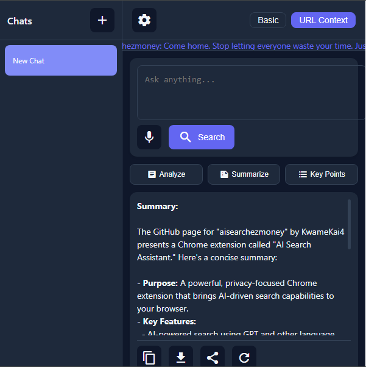
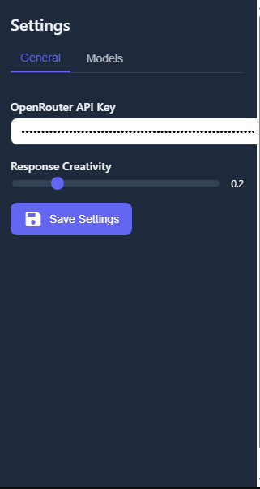
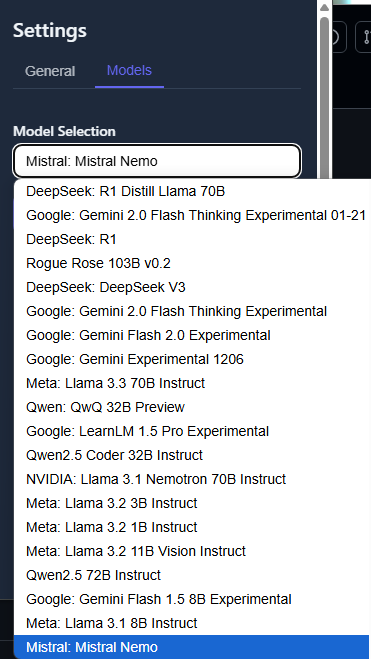

# AI Search Assistant: Revolutionize Your Search Experience

[
[
[
A powerful and privacy-focused Chrome extension that brings AI-driven search capabilities to your browser, making it the ultimate tool for efficient and accurate information gathering. AI Search Assistant stands out from the competition by prioritizing user privacy, offering unparalleled customization, and providing a seamless, intuitive user experience.

## 🚀 Why Choose AI Search Assistant?

1. **Unmatched Privacy:** We believe in keeping your data private. Unlike other search assistants, we don't store your search history or use it for targeted advertising. Your data stays on your device, ensuring your privacy is always protected.

2. **AI-Powered Search:** Leverage the power of GPT and other cutting-edge language models for lightning-fast, accurate, and context-aware search results. Our AI understands the content on the webpage you're currently viewing, providing relevant and tailored search suggestions.

3. **Multimodal Interaction:** Seamlessly switch between voice input and text-to-speech output for a hands-free search experience. Our integration with ElevenLabs ensures high-quality, natural-sounding text-to-speech.

4. **Customizable AI Models:** Choose from a variety of AI models, including free and paid options, to suit your needs and budget. Our multiple model support ensures you always have the best tool for the job.

5. **Intuitive User Interface:** Our sleek and user-friendly popup interface provides quick access to all the features you need, making your search experience efficient and enjoyable.

6. **Local Memory Chats:** Keep track of your previous searches and interactions with our local memory chat feature. Revisit past conversations and build upon them for deeper research and understanding.

## 💻 Features

- AI-powered search with GPT and other language models
- URL context support for page-specific queries
- Voice input and text-to-speech output with ElevenLabs integration
- Customizable AI models for tailored search experiences
- Intuitive and user-friendly popup interface
- Local memory chats for tracking previous searches and interactions

## 🔒 Privacy and Security

At AI Search Assistant, we prioritize your privacy and security. Here's how we protect your data:

- **Zero Data Collection:** We don't store your search history or use it for targeted advertising.
- **Local Processing:** Most processing happens on your device, minimizing data transfer and reducing the risk of data interception.
- **Secure Storage:** Any data stored locally on your device is encrypted to prevent unauthorized access.

## 💰 Invest in the Future of Search

AI Search Assistant offers an unparalleled search experience, combining cutting-edge AI technology with a strong focus on user privacy. By investing in our project, you'll be supporting a team dedicated to pushing the boundaries of search and ensuring that users have control over their data.

Whether you're an individual looking to enhance your browsing experience or a business interested in integrating our AI search capabilities into your products, AI Search Assistant is the perfect solution for your needs. Join us in revolutionizing the way we search and discover information online.

## 📝 Contributing

We welcome contributions from the community! If you'd like to help improve AI Search Assistant, please follow our [Contributing Guidelines](CONTRIBUTING.md) and submit a pull request.

## 📄 License

AI Search Assistant is licensed under the MIT License - see the [LICENSE](LICENSE) file for details.

## 📞 Contact

For any questions, suggestions, or inquiries about investment opportunities, please don't hesitate to reach out to us at [kwame.whe@gmail.com](mailto:kwame.whe@gmail.com).

Let's redefine the way you search – try AI Search Assistant today! 🔎🤖
